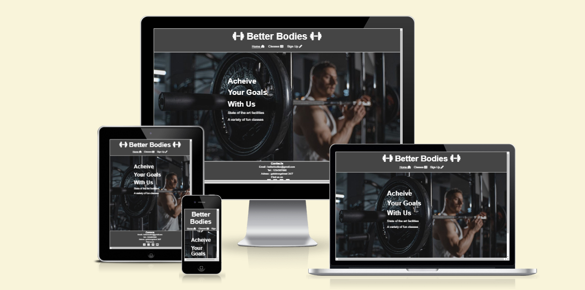
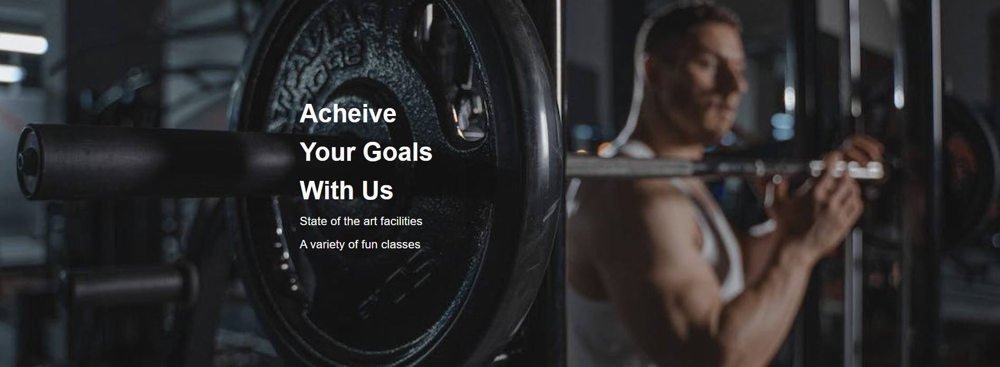

# Better Bodies

Better Bodies is the online presence and portal to the the Stockholm based gym called "Better Bodies". It is a website for for people who exercize, and more importantly for people who are looking to get into exercizing. Wether your are looking to push yourself to your limits, or just get your body moving, Better Bodies accommodates for all.

The purposs of the website is mainly to attract people to this specific gym, and getting the customer motivated to begin their fitnees journey while simultaneously bringing more customers and profit to the gym itself.

# Features

### Existing Features

- Navigation Bar

  - Featured on all three pages, the navigation bar allows users to move effortlessly through the site with links t the home page, the classes and times page, and the signup form.

  - This feature will allow users to navigate through th website without having to return back to the previous page using the "back" button.

  

- The home page image

  - The home page lands you on an image of a gym goer with some bold text.

  - It is meant to motivate people, and get them inspired to workout.

  

- The footer
  -
