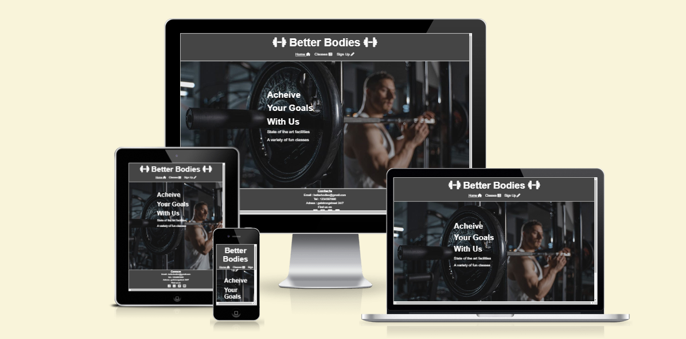
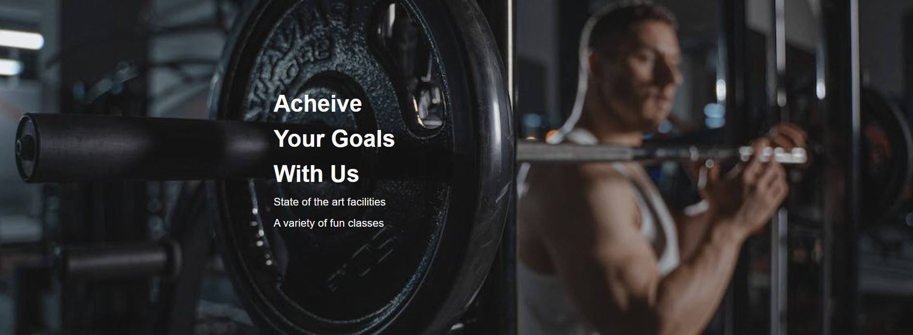
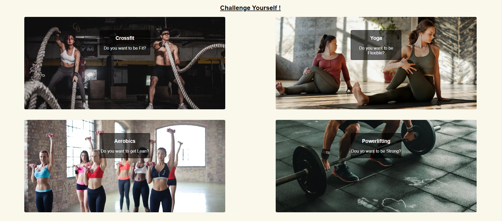
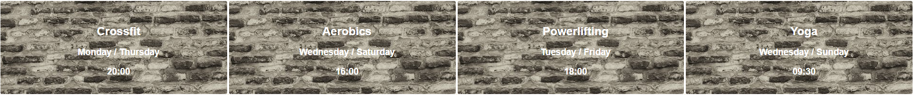
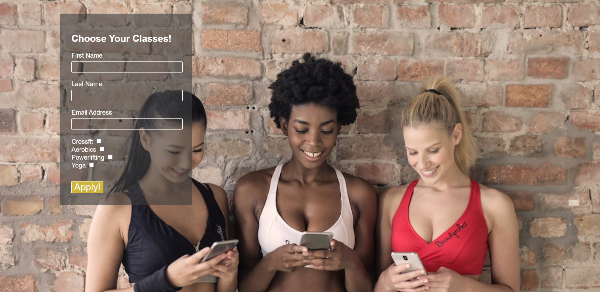

# Better Bodies

Better Bodies is the online presence and portal to the the Stockholm based gym called "Better Bodies". It is a website for for people who exercize, and more importantly for people who are looking to get into exercizing. Wether your are looking to push yourself to your limits, or just get your body moving, Better Bodies accommodates for all.

The purposs of the website is mainly to attract people to this specific gym, and getting the customer motivated to begin their fitnees journey while simultaneously bringing more customers and profit to the gym itself.

# Features

- Navigation Bar

  - Featured on all three pages, the navigation bar allows users to move effortlessly through the site with links t the home page, the classes and times page, and the signup form.

  - This feature will allow users to navigate through th website without having to return back to the previous page using the "back" button.

  

- The home page image

  - The home page lands you on an image of a gym goer with some bold text.

  - It is meant to motivate people, and get them inspired to workout.

  

- The footer

  - The footer area provides contact information and links to social media platforms that the gym posts on. When clicked the link opens in a new tab.

  - The footer is featured on every page and allows customers to get in touch and access content located outside of the website.

  

- Classes

  - The classes section notifies users as to what kind of classes they can attend.

  - Its important for users to be aware of all the optoins they have.

  

- Class Times
  - The class times shows information about what times, and on what days the respectives classes take place.

- The signup form
  - The signup form allows users to enrole themselves into various different classes. It is a digital gateway to their own fitness journey.

# Testing

I have deployed the website through git-hub pages and tested it there. The wesite looks good visually, and keeps good structure when viewed on different screen sizes in dev tool. All internal links where tested and work. All external links were tested and open up in new pages. When first deploying the page, no css was being applied to the html due to miss-spelling in the css link. This was an easy fix. Also, when submitting the signup, it was naot opening in a new tab as i had forgotten the target="\_blank" attribute. It now opens in a new tab.

## Validator testing

- Css
  - No errors were found when running code through the official  validator <a href="https://jigsaw.w3.org/css-validator/" target="_blank">(Jigsaw) validator</a>

- Html
  - No errors were found when passing through the official <a href="https://validator.w3.org/#validate_by_input" target="_blank">W3C validator</a>

# Deployment

- This site was deployed to GitHub pages in these steps.

  - In the GitHub repository, navigate to the Settings tab
  - In the settings secttion click on the pages tab
  - From the source section drop-down menu, select the Master Branch
  - Once the master branch has been selected, the page will be automatically refreshed with a detailed ribbon display to indicate the successful deployment.

- Here is a link to the deployed pag - <a href="https://justinfourie1993.github.io/Better-Bodies" target="_blank">Better Bodies</a>

# Credits 

## Content

- The main code structure for the signup form was taken from Code Institutes <a href="https://learn.codeinstitute.net/courses/course-v1:CodeInstitute+LR101+2021_T1/courseware/4a07c57382724cfda5834497317f24d5/4d85cd1a2c57485abbd8ccec8c00732c/" target="blank">signup form challenge</a>
- Icons in the header and footer were taken from <a href="https://fontawesome.com/" target="_blank">Font Awesome</a>

## Media

- All pictures used throughout the website are taken from <a href="https://www.pexels.com/sv-se/" target="_blank">Pexels</a>

